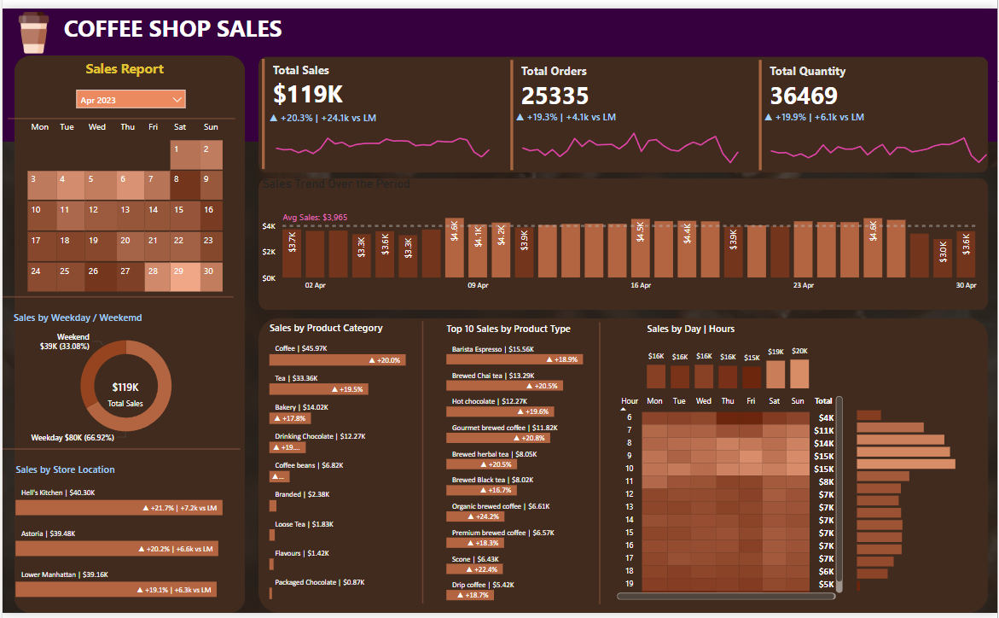

# ☕ Coffee Shop Sales Dashboard – Power BI + SQL Project

This interactive dashboard visualizes key performance metrics for a fictional coffee shop chain, using SQL for backend data cleaning and aggregation, and Power BI for front-end insights. It empowers stakeholders to analyze monthly sales trends, store performance, product category contribution, and customer behavior across different time and location segments.

---

## 📊 Project Overview

- Built using **Power BI** for visualization and **MySQL** for backend preprocessing.
- Covers detailed analysis of **April–May 2023** sales, orders, and quantities.
- Dashboard includes sales breakdowns by **product type, store, time of day, category**, and **week/weekend** insights.

---

## 🧩 Key Features & Visuals

- ✅ **Total KPIs**: $119K+ in Sales, 25K+ Orders, and 36K+ Units Sold
- 🔁 **Month-over-Month (MoM) Growth** metrics for Sales, Orders, and Quantity
- 📅 Calendar-based filter for April 2023
- 🕒 Heatmap of hourly sales by day
- 📍 Store-level performance with MoM comparisons
- 🛒 Top-selling Product Categories & Types
- 📈 Daily Sales Trend visualization

---

## 🔧 Tools & Technologies Used

- **Power BI Desktop**
- **MySQL** (SQL queries for data preparation)
- **DAX** for measures like total revenue and percentage growth
- **Power Query** for minor ETL
- CSV as data source (exported from SQL)

---
## 🖼️ Dashboard Preview


## 🛠️ SQL Data Preparation

SQL was used for:
- ✅ Data type conversion: `transaction_date` and `transaction_time` from strings to proper `DATE` and `TIME`
- ✅ Monthly KPIs and MoM growth calculation via `LAG()` window function
- ✅ Aggregation of Sales, Orders, and Quantity metrics

### 🔍 Key SQL Operations:
```sql
-- Convert transaction_date to DATE
UPDATE `coffee_ shop`
SET transaction_date = STR_TO_DATE(transaction_date, '%m/%d/%Y');
ALTER TABLE `coffee_ shop` MODIFY COLUMN transaction_date DATE;

-- Convert transaction_time to TIME
UPDATE `coffee_ shop`
SET transaction_time = STR_TO_DATE(transaction_time, '%H:%i:%s');
ALTER TABLE `coffee_ shop` MODIFY COLUMN transaction_time TIME;

-- Calculate Monthly Total Sales
SELECT ROUND(SUM(unit_price * transaction_qty)) AS total_sales
FROM `coffee_ shop` WHERE MONTH(transaction_date) = 5;

-- MoM Sales Growth
SELECT 
  MONTH(transaction_date) AS month,
  ROUND(SUM(unit_price * transaction_qty)) AS total_sales,
  (SUM(...) - LAG(...)) / LAG(...) * 100 AS mom_increase_percentage
FROM `coffee_ shop`
GROUP BY MONTH(transaction_date)
Full SQL script is included in the repository for reproducibility.


🚀 How to Use
Import the SQL schema and CSV file into your MySQL database.

Run the provided SQL scripts to clean and aggregate the data.

Open the .pbix file in Power BI Desktop.

Connect Power BI to your SQL output or use the cleaned CSV directly.

Explore visuals with built-in filters and slicers.

📌 License
This project is intended for academic, personal, and portfolio use only.

sql
Copy
Edit

---

## ✅ Updated Resume Bullet Points (with SQL Mention)

> Use 3–5 of these depending on your resume space and relevance:

- 🔧 Used **MySQL** to clean and transform transactional sales data, converting text-based date and time columns into SQL `DATE` and `TIME` types for accurate time-series analysis in Power BI.
- 📊 **Pre-aggregated KPIs** like total sales, orders, and quantity using SQL `SUM`, `COUNT`, and `LAG()` window functions for MoM (Month-over-Month) growth insights.
- ⚙️ Integrated Power BI with SQL output to create a **dynamic dashboard** showing store-wise and product-wise performance metrics using slicers and conditional formatting.
- 🧠 Built visualizations using **calendar filters, heatmaps, bar/donut charts, and DAX measures**, providing insights into peak sales hours and top-performing items.
- 📍 Delivered a business-friendly dashboard that highlights performance trends across weekdays/weekends, store locations, and product categories using a blend of **SQL preprocessing and Power BI interactivity**.

---
